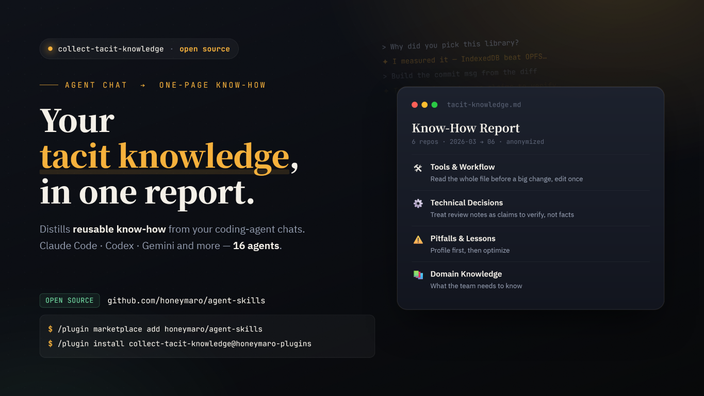

# collect-tacit-knowledge



Extract transferable know-how from your local LLM-CLI conversation logs and produce one
anonymized, shareable one-page report. **Read-only. Privacy-first. Python stdlib only.**

## Install (Claude Code plugin)
This plugin is published via the `honeymaro/agent-skills` marketplace. In Claude Code run:
```
/plugin marketplace add honeymaro/agent-skills
/plugin install collect-tacit-knowledge@honeymaro-plugins
```
Then invoke `/collect-tacit-knowledge:collect-tacit-knowledge`. Requires `python3`. No `pip install`.

### Alternative: plain skill (no plugin)
Copy just the skill folder into your skills directory:
```
git clone https://github.com/honeymaro/agent-skills.git
cp -r agent-skills/plugins/collect-tacit-knowledge/skills/collect-tacit-knowledge ~/.claude/skills/
```
Then invoke `/collect-tacit-knowledge`.

## Use
Invoke the skill and pick a mode: all tools / current project / a selected project. Add
`--project-contains "<substr>"` to scope to a directory (e.g. all repos under one parent).

## Privacy (3-layer defense, tiered)
1. **Normalize** strips code bodies, tool dumps, and obvious secrets before extraction; the
   project path is reduced to its leaf name so usernames/full paths never leave your machine.
2. **Extraction** subagents abstract PII and external client names, never copy secrets/code.
3. **Sanitize** rescans the final report for emails/keys/IPs/username-paths (always) and any
   `--known-names` you supply (opt-in), and masks them.

The default audience is **your own team**, so the report keeps useful context — your company
name and internal product/repo names are NOT masked by default (over-masking removes signal).
Always blocked: secrets/credentials, source-code bodies, PII, and external client/customer
names. When sharing **externally/OSS**, pass `sanitize --known-names <file>` listing the
company/product/sensitive names you want force-masked. Encrypted sources (e.g. ChatGPT
desktop v2+) are not supported and are skipped.

## Supported tools
JSONL: Claude Code, Codex, Copilot CLI, Factory, OpenClaw, Kimi, Vibe, **Antigravity**.
SQLite: Cursor, OpenCode, Crush, Hermes. JSON/MD: Gemini, Qwen, Aider.

### Verification status
- **Verified against real local data:** Claude Code, **Codex** (rollout JSONL at
  `~/.codex/sessions/Y/M/D/rollout-*.jsonl`), Gemini.
- **Implemented to documented format (fixture-validated):** Copilot CLI, Factory, OpenClaw,
  Kimi, Vibe, Cursor, OpenCode, Crush, Hermes, Qwen, Aider, Antigravity. Validated by
  synthetic fixtures; not yet confirmed against real data here.

Notes:
- **Gemini CLI was deprecated 2026-06-18** in favor of **Antigravity** (a VS Code fork).
  The Gemini adapter still reads existing `~/.gemini/tmp/<hash>/chats/session-*.json`; the new
  Antigravity adapter reads `<appData>/Antigravity/brain/<id>/.system_generated/logs/*.jsonl`
  (documented format — no local Antigravity conversations to verify against yet).
- Codex's legacy `~/.codex/logs_*.sqlite` is a Rust diagnostics log (no conversations), so the
  legacy adapter degrades to yielding nothing.

## Layout (within the marketplace monorepo)
```
agent-skills/                                  # marketplace repo
  .claude-plugin/marketplace.json                # lists plugins
  plugins/collect-tacit-knowledge/               # this plugin
    .claude-plugin/plugin.json
    skills/collect-tacit-knowledge/              # the skill (SKILL.md + scripts/ + references/)
    tests/                                       # dev tests + fixtures
    docs/                                        # design + plan
```

## Add a provider
Subclass `JsonlFileSessionAdapter` or `SqliteAdapter` in
`skills/collect-tacit-knowledge/scripts/ctk/providers/`, register it in
`.../scripts/ctk/registry.py`, add a fixture under `tests/fixtures/`, and a test. See
`skills/collect-tacit-knowledge/scripts/ctk/providers/claude_code.py` as the reference.

## Test
From this plugin directory (`plugins/collect-tacit-knowledge/`):
`python -m unittest discover -s tests -v`
